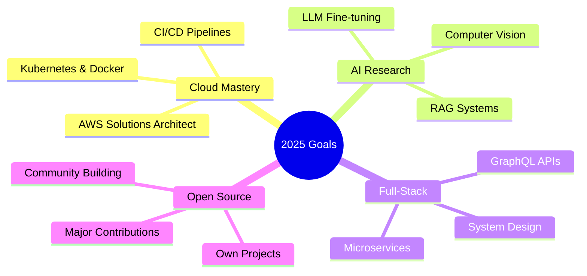

<div align="center">
  
<!-- Animated Header -->


<!-- Animated Social Badges -->
<p>
  <a href="https://www.linkedin.com/in/asishadimulapu"></a>
  <a href="mailto:hiring@getsethire.com"></a>
  <a href="https://github.com/AsishAdimulapu"></a>
  
</p>

<!-- Animated Typing SVG -->


<!-- Animated Snake -->
<picture>
  <source media="(prefers-color-scheme: dark)" srcset="https://raw.githubusercontent.com/platane/snk/output/github-contribution-grid-snake-dark.svg" />
  <source media="(prefers-color-scheme: light)" srcset="https://raw.githubusercontent.com/platane/snk/output/github-contribution-grid-snake.svg" />
  
</picture>

</div>

---


##  **About Me**

```typescript
const asish = {
    pronouns: "He" | "Him",
    location: "Hyderabad, India 🇮🇳",
    education: "B.Tech AIML @ Anurag University",
    
    currentFocus: [
        "🧠 Deep Learning & Neural Networks",
        "☁️ Cloud Architecture (AWS)",
        "🔗 LLM & RAG Systems",
        "⚡ Full-Stack AI Applications"
    ],
    
    askMeAbout: [
        "Machine Learning", "MERN Stack",
        "System Design", "API Development"
    ],
    
    funFact: "I debug with console.log and I'm not ashamed! 😄"
};
```

<br clear="both">

---

##  **Tech Arsenal**

<div align="center">

### 💻 Languages & Core


### 🎨 Frontend & Design


### ⚙️ Backend & Database


### 🧠 AI/ML & Data Science


### ☁️ Cloud & DevOps


</div>

---

##  **Featured Projects**

<div align="center">

<a href="#">
  
</a>
<a href="#">
  
</a>

</div>

### 🧠 Deepfake Detection System
<table>
<tr>
<td width="60%">
  
> 🎯 **AI-Powered Media Authenticity Verification**

```
✅ Frame extraction + real-time face detection
✅ Fine-tuned CNN on large-scale datasets  
✅ 95%+ accuracy on benchmark tests
✅ Production-ready REST API
```

**Tech Stack:**
`Python` `TensorFlow` `Keras` `OpenCV` `NumPy` `FastAPI`

<p>
  <a href="#"></a>
  <a href="#"></a>
</p>

</td>
<td width="40%" align="center">
  
</td>
</tr>
</table>

---

### 💬 MERN Gemini AI Chatbot
<table>
<tr>
<td width="40%" align="center">
  
</td>
<td width="60%">

> 🤖 **Enterprise-Grade Conversational AI Platform**

```
✅ Google Gemini API integration
✅ JWT Authentication & session management
✅ Real-time streaming responses
✅ MongoDB persistence with chat history
✅ Responsive modern UI/UX
```

**Tech Stack:**
`React` `Node.js` `Express` `MongoDB` `Gemini API` `JWT`

<p>
  <a href="#"></a>
  <a href="#"></a>
</p>

</td>
</tr>
</table>

---

### 🔢 Neural Digit Recognition
<table>
<tr>
<td width="60%">

> ✍️ **Real-Time Handwriting Intelligence**

```
✅ Custom CNN architecture
✅ 98.5%+ accuracy on MNIST
✅ Interactive Tkinter canvas
✅ Instant prediction feedback
```

**Tech Stack:**
`Python` `TensorFlow` `Keras` `Tkinter` `PIL` `NumPy`

<p>
  <a href="#"></a>
  <a href="#"></a>
</p>

</td>
<td width="40%" align="center">
  
</td>
</tr>
</table>

---

##  **GitHub Analytics**

<div align="center">

</div>

<br>

<p align="center">
  
  
</p>

<p align="center">
  
</p>

<p align="center">
  
</p>

---

## 🎯 **Current Focus & Goals**

<div align="center">



</div>

---

## 💡 **Expertise & Consulting**

<div align="center">

| 🧠 **AI/ML** | 🖥️ **Development** | ☁️ **Infrastructure** |
|:---:|:---:|:---:|
| Deep Learning Models | MERN Stack Apps | AWS Architecture |
| Computer Vision | API Development | Docker & Kubernetes |
| NLP & LLMs | Database Design | CI/CD Pipelines |
| Data Pipelines | System Design | Cloud Optimization |

</div>

---

## 🤝 **Let's Build Together**

<div align="center">


### 💼 Open for Opportunities

<table>
<tr>
<td align="center">
  
  <br><b>AI Projects</b>
  <br>ML/DL Solutions
</td>
<td align="center">
  
  <br><b>Full-Stack</b>
  <br>Web Applications
</td>
<td align="center">
  
  <br><b>Open Source</b>
  <br>Contributions
</td>
<td align="center">
  
  <br><b>Consulting</b>
  <br>Tech Strategy
</td>
</tr>
</table>

</div>

---

## 📫 **Connect & Collaborate**

<div align="center">

<a href="https://www.linkedin.com/in/asishadimulapu">
  
</a>
<a href="mailto:hiring@getsethire.com">
  
</a>
<a href="https://github.com/AsishAdimulapu">
  
</a>

<br><br>

<!-- Spotify Playing -->


</div>

---

<div align="center">

### 💭 Random Dev Quote


<br>

### 📊 Weekly Coding Stats
<!--START_SECTION:waka-->
```text
Python       12 hrs 45 mins  ████████████░░░░░  48.32%
JavaScript   8 hrs 20 mins   ███████░░░░░░░░░░  31.58%
TypeScript   3 hrs 15 mins   ███░░░░░░░░░░░░░░  12.33%
CSS          1 hr 30 mins    █░░░░░░░░░░░░░░░░   5.68%
Other        33 mins         ░░░░░░░░░░░░░░░░░   2.09%
```
<!--END_SECTION:waka-->

</div>

---


<div align="center">

**⚡ "Code is poetry. AI is the future. Together, we build the impossible." ⚡**

<br>


<br><br>

**🚀 Last Updated: 2025 | Currently Building Amazing Things**

</div>
